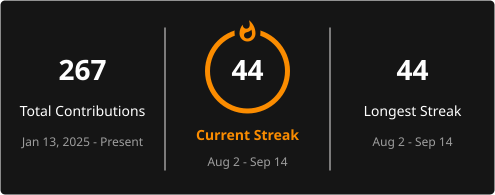

<h3><code>vedansh@github ~ $ ./contributions.sh</code></h3>

  

<h3><code>vedansh@github ~ $ ./stats.sh</code></h3>

  

<h3><code>vedansh@github ~ $ whoami</code></h3>

  

<h3><code>vedansh@github ~ $ ./connect.sh</code></h3>

  
  
  
  

